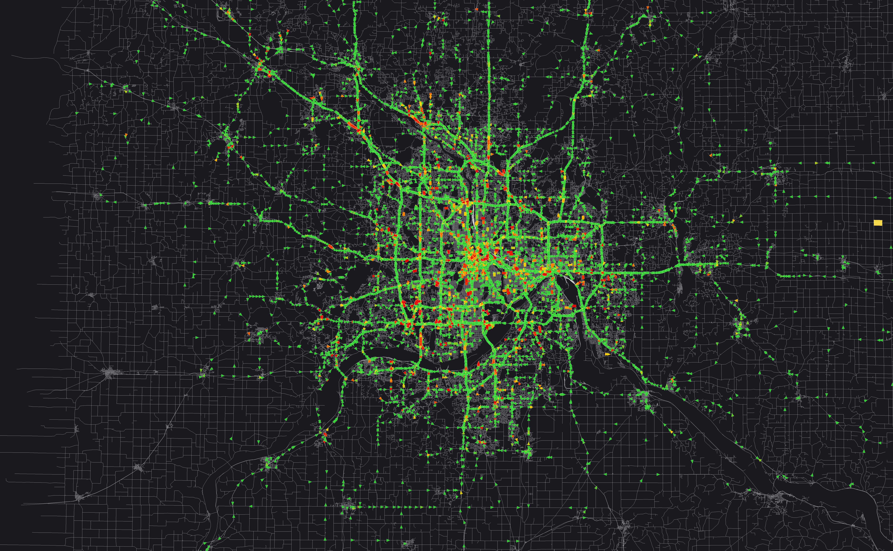
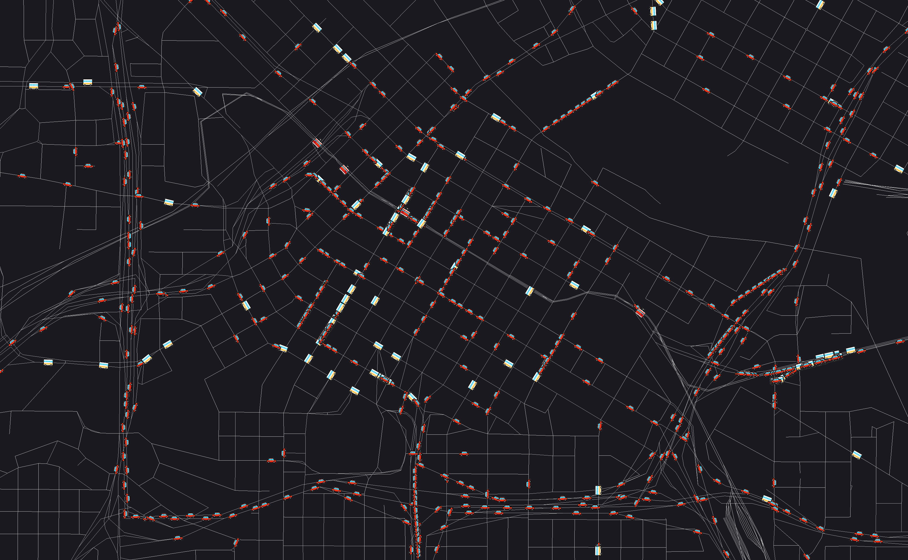
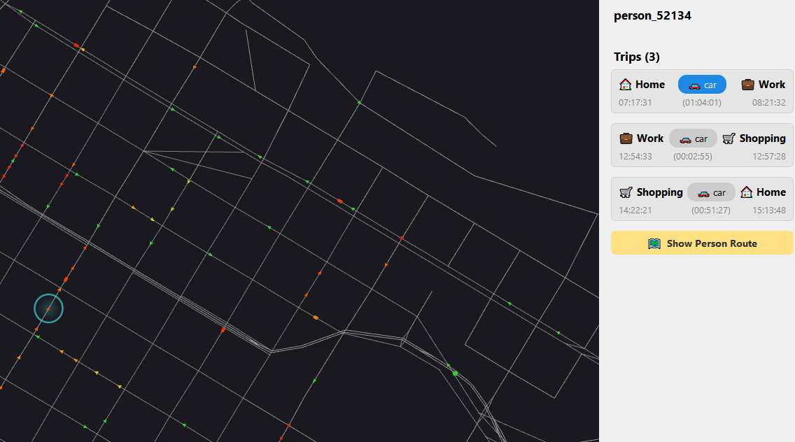
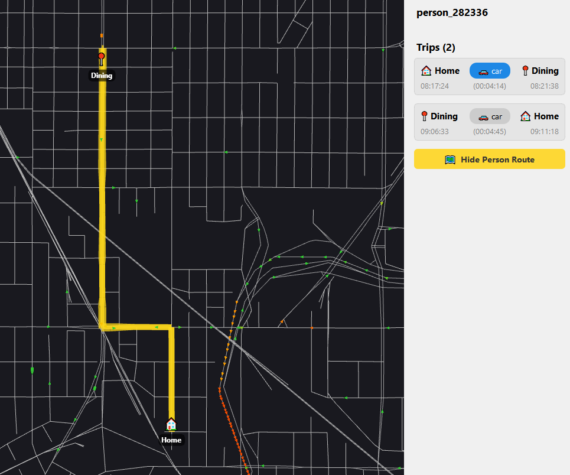
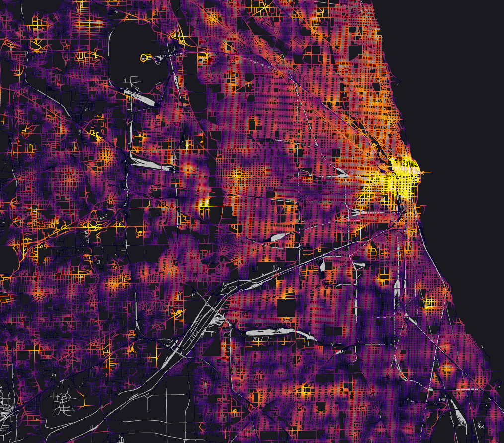

# TAREEK-Vis - Simulation Visualizer

A high-performance desktop application for visualizing MATSim simulation outputs (network and events).

<table align="center">
  <tr>
    <td width="50%" align="center">
      <br />
      <sub>Simulated vs. observed link volumes across a full metro-area network</sub>
    </td>
    <td width="50%" align="center">
      <br />
      <sub>Frame-accurate vehicle animation, zoomed to street level</sub>
    </td>
  </tr>
  <tr>
    <td width="50%" align="center">
      <br />
      <sub>Clicking a vehicle shows its driver's full day of trips</sub>
    </td>
    <td width="50%" align="center">
      <br />
      <sub>Tracing a selected person's route and activities on the map</sub>
    </td>
  </tr>
  <tr>
    <td width="50%" align="center">
      <br />
      <sub>Activity density along the road network, measured by driving distance</sub>
    </td>
    <td width="50%" align="center"></td>
  </tr>
</table>

## Paper

TAREEK-Vis was accepted as a demo paper at
[ACM SIGSPATIAL 2026](https://sigspatial2026.sigspatial.org/):

> Jalal Khalil, Arein Duaibes, Da Yan, and Virginia Sisiopiku. 2026.
> **TAREEK-Vis: An Interactive Visualization Tool for Large-Scale MATSim
> Traffic Simulations [Demo]**. In *Proceedings of The 34th ACM International
> Conference on Advances in Geographic Information Systems (SIGSPATIAL '26)*.
> ACM, New York, NY, USA.

📄 [Read the paper (pre-publication version)](assets/tareek_vis_sigspatial2026_demo.pdf)

This is the pre-publication version; the camera-ready copy will replace it
here once available, along with the official ACM DOI link.

## Features

- Load and visualize MATSim network files (nodes and links)
- Animate vehicle movements from events files
- Click a vehicle to track it: driver, per-day trip list (departure/arrival
  activity, times, mode per leg), transit line/route and live passenger counts
- Time-based playback with variable speed control
- Pan and zoom navigation
- Memory-efficient handling of large datasets (2GB+ events)
- Automatic preprocessing with caching (cache format changes trigger a
  one-time automatic re-preprocess)

## Download & Install (Windows, no build required)

For most users, the easiest way to run TAREEK-Vis is the prebuilt installer —
no Qt, no compiler, no MSYS2 needed.

1. Go to the [Releases page](https://github.com/jalal1/TAREEK-Vis/releases)
   and download `TAREEK-Vis-Setup-x.y.z.exe` from the latest release
   (a portable `TAREEK-Vis-x.y.z-portable.zip` is also attached if you'd
   rather not install anything — just unzip and run `TAREEK-Vis.exe`).
2. Run the installer. It doesn't need admin rights (installs for your user
   only).
3. Windows SmartScreen may show "Windows protected your PC" because the
   installer isn't code-signed — click **More info → Run anyway**.
4. Launch TAREEK-Vis from the Start menu (or desktop shortcut, if selected
   during install).

The rest of this section is for building from source instead.

## Requirements

- CMake 3.20+
- Qt6 (Widgets, OpenGL, OpenGLWidgets, Concurrent)
- ZLIB
- C++20 compiler (GCC 10+, Clang 12+, MSVC 2019+)
- OpenGL 3.3+ capable graphics

## Building

### Windows (MSYS2 / UCRT64 — recommended)

This is the toolchain the provided `build.bat` / `build.sh` scripts are built
for.

1. Install [MSYS2](https://www.msys2.org/), then from an MSYS2 **UCRT64**
   terminal install the dependencies:
   ```bash
   pacman -S mingw-w64-ucrt-x86_64-cmake \
             mingw-w64-ucrt-x86_64-qt6-base \
             mingw-w64-ucrt-x86_64-qt6-tools \
             mingw-w64-ucrt-x86_64-zlib
   ```
2. Build:
   ```bash
   cd path/to/TAREEK-Vis
   ./build.sh
   ```
   (or `build.bat` from a regular Command Prompt/PowerShell — it sets up the
   UCRT64 PATH itself)
3. Run: the exe needs the UCRT64 runtime DLLs on PATH, so either run it from
   an MSYS2 UCRT64 terminal, or add `C:\msys64\ucrt64\bin` to PATH first.

If you have both `mingw64` and `ucrt64` MSYS2 subsystems installed, make sure
UCRT64 comes first in PATH — mixing the two toolchains causes runtime errors
(MOC failing with exit code `0xc0000139` is the usual symptom).

### Windows (vcpkg / MSVC — untested)

Not the toolchain used by `build.bat`/`build.sh`; provided as a starting
point if you prefer MSVC, but not verified to build cleanly.

```bash
# Install dependencies
vcpkg install qt6:x64-windows zlib:x64-windows

# Configure
cmake -B build -S . -DCMAKE_TOOLCHAIN_FILE=[vcpkg-root]/scripts/buildsystems/vcpkg.cmake

# Build
cmake --build build --config Release
```

### Linux

```bash
# Install dependencies (Ubuntu/Debian)
sudo apt install qt6-base-dev qt6-opengl-dev libgl1-mesa-dev zlib1g-dev

# Configure
cmake -B build -S .

# Build
cmake --build build
```

### Releasing (maintainers)

Pushing a tag matching `v*.*.*` (e.g. `v1.0.1`) triggers
[`.github/workflows/release.yml`](.github/workflows/release.yml), which builds
the app, assembles the installer and a portable ZIP, and publishes them to a
new GitHub Release automatically:

```bash
git tag v1.0.1
git push origin v1.0.1
```

## Usage

1. Launch TAREEK-Vis
2. File → Open Folder... (Ctrl+O) and pick your simulation output folder
   - TAREEK-Vis finds `*network*.xml[.gz]` and `*events*.xml[.gz]` automatically
   - A `*transitSchedule*.xml[.gz]` file is loaded automatically if present
   - If a folder has multiple candidates, files with the `output_` prefix are
     preferred; otherwise TAREEK-Vis asks which one to use
   - For non-standard layouts (e.g. network and events in different folders),
     use File → Open Files (Advanced)...
3. Wait for preprocessing (first time only - creates cached .bin files)
4. Use the timeline to play/pause and scrub through the simulation
5. Recently opened folders appear under File → Recent Folders (last 5)

You can also launch with a folder argument: `TAREEK-Vis <folder>`

### Keyboard Shortcuts

- **Space**: Play/Pause
- **F**: Fit network to view
- **+/-**: Zoom in/out
- **Home**: Go to start
- **End**: Go to end

### Mouse Controls

- **Left drag**: Pan
- **Scroll wheel**: Zoom

## Input File Format

TAREEK-Vis expects MATSim-compatible XML files:

### network.xml(.gz)
```xml
<network>
  <nodes>
    <node id="1" x="123.45" y="678.90" />
  </nodes>
  <links>
    <link id="1" from="1" to="2" length="100" freespeed="13.89" />
  </links>
</network>
```

### events.xml(.gz)
```xml
<events>
  <event time="0.0" type="vehicle enters traffic" vehicle="v1" link="1" />
  <event time="10.0" type="entered link" vehicle="v1" link="2" />
  <event time="20.0" type="left link" vehicle="v1" link="1" />
</events>
```

## Architecture

```
TAREEK-Vis
├── Parsers         # XML → Binary preprocessing
├── Data Layer      # Network index, Chunk manager
├── Renderers       # OpenGL network/vehicle rendering
└── UI              # Qt widgets (map, timeline)
```

### Memory Management

- Network data loaded into memory with spatial indexing
- Events stored in 5-minute chunks, loaded on demand
- LRU cache for event chunks (configurable max memory)
- Binary file caching for fast subsequent loads

## License

TAREEK-Vis is licensed under the [GNU General Public License v3.0](LICENSE).

### Third-Party Libraries

| Library | License | Usage |
|---------|---------|-------|
| [Qt6](https://www.qt.io/) | LGPL v3.0 | UI framework (dynamically linked) |
| [PugiXML](https://pugixml.org/) | MIT | XML parsing (bundled) |
| [ZLIB](https://www.zlib.net/) | Zlib License | Gzip decompression |
| [FFmpeg](https://ffmpeg.org/) | LGPL/GPL | Video recording (optional, external subprocess) |

### Background Map Tiles

The optional background map layers (View → Background Map) stream raster tiles
from third-party services. TAREEK-Vis does not redistribute these tiles; they
are fetched directly by the user's machine at display time. Each service
requires attribution when its imagery is shown, reproduced, or published:

| Layer | Provider | Required attribution |
|-------|----------|----------------------|
| OpenStreetMap | [CARTO](https://carto.com/attributions) Voyager basemap, built on OpenStreetMap data | © OpenStreetMap contributors, © CARTO |
| Satellite | [Esri World Imagery](https://www.arcgis.com/home/item.html?id=10df2279f9684e4a9f6a7f08febac2a9) (ArcGIS Online) | Esri, Maxar, Earthstar Geographics, and the GIS User Community |
| Topographic | [OpenTopoMap](https://opentopomap.org/) | © OpenStreetMap contributors, © OpenTopoMap (CC-BY-SA) |

If you publish figures, screenshots, or videos produced with a background map
enabled, include the corresponding attribution in the caption or credits.
Users are responsible for complying with each provider's terms of use, which
may restrict commercial or high-volume use.

See [THIRD_PARTY_LICENSES.md](THIRD_PARTY_LICENSES.md) for full license texts.
